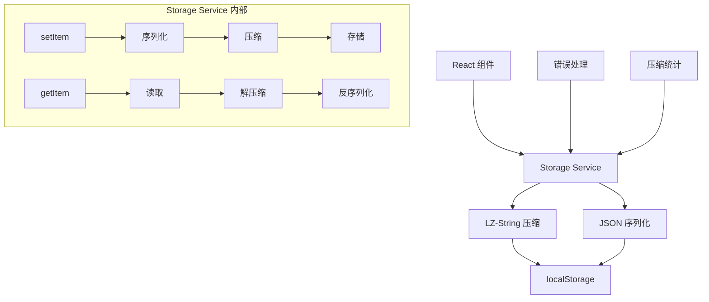

# 设计文档

## 概述

本设计实现了一个基于 LZ-String 的 localStorage 包装器服务，为 RACI 任务管理应用提供透明的数据压缩存储功能。该服务将自动压缩所有存储到 localStorage 的数据，包括任务数据、团队名单和主题设置，从而减少存储空间占用并提升应用性能。

## 架构

### 系统架构图



### 数据流程

1. **存储流程**：数据 → JSON序列化 → LZ-String压缩 → localStorage
2. **读取流程**：localStorage → LZ-String解压缩 → JSON反序列化 → 数据
3. **错误处理**：压缩失败时回退到原始存储，解压缩失败时尝试读取原始数据

## 组件和接口

### StorageService 类

```typescript
interface IStorageService {
  setItem<T>(key: string, value: T): void;
  getItem<T>(key: string): T | null;
  removeItem(key: string): void;
  clear(): void;
  getCompressionStats(key?: string): CompressionStats;
}

interface CompressionStats {
  originalSize: number;
  compressedSize: number;
  compressionRatio: number;
  keys?: string[];
}
```

### 核心方法实现

```typescript
class StorageService implements IStorageService {
  private static instance: StorageService;
  private compressionEnabled: boolean = true;
  private stats: Map<string, CompressionStats> = new Map();

  static getInstance(): StorageService {
    if (!StorageService.instance) {
      StorageService.instance = new StorageService();
    }
    return StorageService.instance;
  }

  setItem<T>(key: string, value: T): void {
    try {
      const serialized = JSON.stringify(value);
      const originalSize = serialized.length;
      
      if (this.compressionEnabled) {
        const compressed = LZString.compressToUTF16(serialized);
        const compressedSize = compressed.length;
        
        // 记录压缩统计
        this.stats.set(key, {
          originalSize,
          compressedSize,
          compressionRatio: originalSize / compressedSize
        });
        
        localStorage.setItem(key, compressed);
        this.logCompressionStats(key, originalSize, compressedSize);
      } else {
        localStorage.setItem(key, serialized);
      }
    } catch (error) {
      this.handleStorageError('setItem', key, error);
    }
  }

  getItem<T>(key: string): T | null {
    try {
      const stored = localStorage.getItem(key);
      if (!stored) return null;

      // 尝试解压缩
      let decompressed: string;
      try {
        decompressed = LZString.decompressFromUTF16(stored);
        if (!decompressed) {
          // 解压缩失败，可能是原始数据
          decompressed = stored;
        }
      } catch {
        // 解压缩异常，使用原始数据
        decompressed = stored;
      }

      return JSON.parse(decompressed);
    } catch (error) {
      this.handleStorageError('getItem', key, error);
      return null;
    }
  }
}
```

## 数据模型

### 存储键映射

```typescript
enum StorageKeys {
  TASKS = 'raci_tasks',
  ROSTER = 'raci_roster', 
  THEME = 'theme'
}

interface StorageData {
  [StorageKeys.TASKS]: Task[];
  [StorageKeys.ROSTER]: string[];
  [StorageKeys.THEME]: 'light' | 'dark';
}
```

### 压缩统计数据模型

```typescript
interface CompressionStats {
  originalSize: number;      // 原始数据大小（字节）
  compressedSize: number;    // 压缩后大小（字节）
  compressionRatio: number;  // 压缩比率
  timestamp?: number;        // 统计时间戳
}

interface GlobalCompressionStats {
  totalOriginalSize: number;
  totalCompressedSize: number;
  averageCompressionRatio: number;
  keyStats: Record<string, CompressionStats>;
}
```

## 正确性属性

*属性是一个特征或行为，应该在系统的所有有效执行中保持为真——本质上，是关于系统应该做什么的正式声明。属性作为人类可读规范和机器可验证正确性保证之间的桥梁。*

基于预工作分析和属性反思，以下是合并冗余后的核心正确性属性：

### 属性 1：完整的存储服务功能
*对于任何*可序列化的数据对象和任何标准 localStorage 操作，StorageService 应该提供完全兼容的 API 接口，自动处理压缩存储，并保证数据往返的完整一致性
**验证：需求 1.1, 1.2, 1.3, 1.4, 2.1, 2.2, 2.3, 3.1, 3.2, 3.3, 3.4, 3.5**

### 属性 2：压缩统计和监控完整性
*对于任何*存储操作，系统应该准确计算和提供压缩统计信息（原始大小、压缩大小、压缩比率），并提供完整的统计查询 API
**验证：需求 5.1, 5.2, 5.3, 5.5**

## 错误处理

### 错误类型和处理策略

```typescript
enum StorageErrorType {
  COMPRESSION_FAILED = 'COMPRESSION_FAILED',
  DECOMPRESSION_FAILED = 'DECOMPRESSION_FAILED', 
  QUOTA_EXCEEDED = 'QUOTA_EXCEEDED',
  INVALID_DATA = 'INVALID_DATA',
  STORAGE_UNAVAILABLE = 'STORAGE_UNAVAILABLE'
}

class StorageError extends Error {
  constructor(
    public type: StorageErrorType,
    public key: string,
    message: string,
    public originalError?: Error
  ) {
    super(message);
    this.name = 'StorageError';
  }
}
```

### 错误处理流程

1. **压缩失败**：记录错误，回退到原始数据存储
2. **解压缩失败**：尝试读取原始数据，如果仍失败则返回 null
3. **存储空间不足**：抛出明确错误，建议用户清理数据
4. **数据格式错误**：记录错误，返回默认值或 null
5. **localStorage 不可用**：提供内存存储作为临时方案

## 测试策略

### 双重测试方法

本项目将采用单元测试和基于属性的测试相结合的方法：

- **单元测试**：验证特定示例、边界情况和错误条件
- **基于属性的测试**：验证所有输入的通用属性

### 单元测试重点

- 特定数据类型的存储和读取
- 错误情况的处理
- API 接口的兼容性
- 组件集成点

### 基于属性的测试配置

- **测试库**：使用 `fast-check` 进行基于属性的测试
- **最小迭代次数**：每个属性测试运行 100 次迭代
- **测试标记格式**：**功能：localStorage-compression，属性 {编号}：{属性文本}**
- **属性映射**：每个正确性属性必须对应一个基于属性的测试

### 测试数据生成策略

```typescript
// 智能测试数据生成器
const taskGenerator = fc.record({
  id: fc.string(),
  title: fc.string(1, 100),
  description: fc.string(0, 500),
  status: fc.constantFrom('TODO', 'IN_PROGRESS', 'DONE', 'ARCHIVED'),
  roles: fc.record({
    responsible: fc.array(fc.string()),
    accountable: fc.string(),
    consulted: fc.array(fc.string()),
    informed: fc.array(fc.string())
  })
});

const rosterGenerator = fc.array(fc.string(1, 50), 1, 20);
const themeGenerator = fc.constantFrom('light', 'dark');
```

### 性能测试

- 测试大数据量的压缩性能
- 验证压缩比率是否符合预期
- 确保读写操作的响应时间在可接受范围内